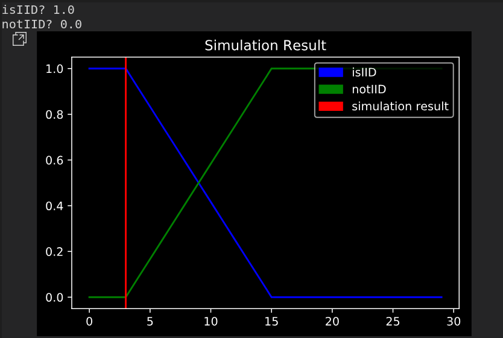

# Margot - IID hypothesis testing

In many performance evalutation project it is relevant to check the IID hypothesis on samples.

The IID hypothesis (indepent identically distributed) is very important becouse it is used
in many statisthical theorem.

PolyBench benchmark is tested over different hardware environments.
Each benchmark's program is runned 200 times in order to track the execution times.

Statisthical analysis are done to understand when and why IID hypothesis is not appliable.

As described in the dedicated paragraph , permutation test is applied to execution times in order
to understand wheter samples are coming from the same population.

Final consideration and results are added.

-----------

## Scripts
We have used two main scripts for this project:
- runBenchmark
- buildReport


### RunBenchmark

#### Input of the script
- Benchmark Polybench
- NUMBER_OF_EXECUTION (int)
    - how many times the script has to execute every application of the benchmark
- CLEAN_UP_CACHES (boolean)
    - If *TRUE* the script cleans all the caches before starting every execution.
- CPU (int)
    - The id of the CPU where the script will launch the applications
    - id "-1" to launch the application without taskset

#### Output of the script
- A file for each application providing execution times of all the simulations.

#### How it works
- For each application of the benchmark:
    - Compiles application with execution time reporting option.
        ```bash
        gcc -O3 -I utilities -I
        linear-algebra/kernels/atax utilities/polybench.c
        linear-algebra/kernels/atax/atax.c
        -DPOLYBENCH_TIME -o atax_time
        ```

    - for NUMBER_OF_EXECUTION times:
        - If CLEAN_UP_CACHES is setted true:
            - clean up the caches with command
                ```python
                os.system("sync; echo 3 > /proc/sys/vm/drop_caches")
                ```
        - If CPU != -1:
            - launch the application with taskset
                ```python
                run_cmd = "taskset -c "+str(CPU)+" ./" +
                 name_of_script + "_time >> " +
                 outFileName

                call(run_cmd, shell=True, stdout=PIPE)
                ```
        - else:
            - launch application without taskset
                ```python
                run_cmd = "./" + name_of_script + "_time >> " + outFileName
                call(run_cmd, shell=True, stdout=PIPE)
                ```
        - Execution times provided by applications are saved in a file.


### BuildReport

#### Input of the script
- The files of all the execution times returned by the previous script.  

#### Output of the script
- A pdf file with:
    - Plots of the data
    - Result of the iid analysis

#### How it works
- It simply loads the data from the file
- Compute statistical analysis (see the "Statisthical approach" charapter for more information)
- Save plots and iid analysis result in a pdf file.

-----------------------------------------------------

## Knobs
Benchmark is tested under different hardware environment. Each of this knobs is set to ON / OFF depending on the simulation.
- **system noise**
    - OFF - cpu is isolated and program runs without any interference
    - ON - not isolated cpu.
- **Clean cache**
    - ON - caches are cleaned up after every run.
    - OFF - caches are not cleaned
- **Processor frequency (DVFS or fixed)**
    - DVFS: is enabled
    - FIXED: DVFS id disabled, processor Frequency is 1500 GHz
- **Processor Turbo**
    - ON
    - OFF
- **Co-running application**
    - ON - programs run while other process are sharing processor and memory
    - OFF - benchmark program are running alone.

--------------------------------------------------------

## Statisthical approach

**Permutation tests** (also called exact tests, randomization tests, or re-randomization tests) are nonparametric test procedures to test the null hypothesis that two different groups come from the same distribution.

A permutation test can be used for significance or hypothesis testing without requiring to make any assumptions about the sampling distribution (e.g., it doesn\'t require the samples to be normal distributed).

Permutation test instead Welch\'s t-test has been chosen becouse our sample did not fit with a normal distribution.

In order to double-check this thesis (No gaussian samples) a normality test has been applied to sample confirming the intuiton coming from graphs (29/30 simulation were not normal with a confidence of 95%)

### Implementation details

In order to build a more stable iid test we have used a k-fold cross validation.
Hence the idea is:

1. Take the dataset containing all the execution times of a given application during a given simulation.
2. Divide the dataset in 5 folds
3. Compute the permutation test between a fold and the remaining 4 folds (significance level = 0.05)
4. Repeat point 3 for all the 5 folds
5. The final result is a tuple of two elements:
    - **isIid**, a boolean computed using a plurality voting system between the 5 partial results.
    - **p-value**, derived as follows:
        - if isIid==True, p-value is computed as the mean of p-values of tests resulting iid.
        - if isIid==False, p-value is computed as the mean of p-values of tests resulting not iid.

--------------------------------------------------

## Simulations

In order to infer the result of each simulation, we have decided to use a membership function with the following shape:


The membership to the IID hypothesis is linear in the interval (3,15), and saturates outside.

We have chosen this interval using as lower bound the failures in the simulation with "vergin" environment, and as upper bound the half of the number of applications tested (becouse we are confident on the fact that if the half of applications fails we can definitely assert that it\'s not safe to use the IID hypothesis in that environment).


#### Simulation 1: Vergin environment

##### Environment:

- Clean up caches every iteration **ON**
- DVFS **OFF** --> 1.5GHz
- Turbo **OFF**
- no system noise
    - isolate cpus: 0, 2 (applications launched in cpu 0, with taskset)
- no co-running applications

##### IID hypothesis failure:

- [ floyd-warshall ] p-value: 0.0120619824 IID: False
- [ ludcmp ] p-value: 0.0138907432 IID: False
- [ mvt ] p-value: 0.00010789 IID: False

##### Result:


------------------------------------------------------
#### Simulation 2: DVFS on

##### Environment:

- Clean up caches every iteration **ON**
- DVFS **ON**
- Turbo **OFF**
- no system noise
    - isolate cpus: 0, 2 (applications launched in cpu 0)
- no co-running applications

##### IID hypothesis failure:

- [ 2mm ] p-value: 0.0027626631 IID: False
- [ floyd-warshall ] p-value: 0.0002839507 IID: False

##### Result:


------------------------------------------------
#### Simulation 3: without cleaning caches

##### Environment:

- Clean up caches every iteration **OFF**
- DVFS **OFF** --> 1.5GHz
- Turbo **OFF**
- no system noise
    - isolate cpus: 0, 2 (applications launched in cpu 0)
- no co-running applications

##### IID hypothesis failure:

- [ 2mm ] p-value: 0.0189239917 IID: False
- [ 3mm ] p-value: 0.0009817808 IID: False
- [ fdtd-apml ] p-value: 0.0109419973 IID: False
- [ symm ] p-value: 0.001749174 IID: False

##### Result:


------------------------------------------------
#### Simulation 4: With system noise

##### Environment:

- Clean up caches every iteration **ON**
- DVFS **OFF** --> 1.5GHz
- Turbo **OFF**
- system noise (no cpu isolate and no taskset)
- no co-running applications

##### IID hypothesis failure:

- [ 2mm ] p-value: 0.0024806002 IID: False
- [ bicg ] p-value: 0.0270742666 IID: False
- [ lu ] p-value: 0.0029190172 IID: False
- [ ludcmp ] p-value: 0.0029084751 IID: False
- [ syrk ] p-value: 0.0076487001 IID: False

##### Result:


------------------------------------------------
#### Simulation 5: with Turbo

##### Environment:

- Clean up caches every iteration **ON**
- DVFS **ON**
- Turbo **ON**
- no system noise
    - isolate cpus: 0, 2 (applications launched in cpu 0)
- no co-running applications

##### IID hypothesis failure:
- all iid

##### Result:


---------------------------------------------------------

#### Simulation 6: No cleaning up of caches and system noise

##### Environment:

- Clean up caches every iteration **OFF**
- DVFS **OFF** --> 1.5GHz
- Turbo **OFF**
- system noise (no cpu isolate and no taskset)

##### IID hypothesis failure:

- all iid

##### Result:


---------------------------------------------------
#### Simulation 7: Co-running application

##### Enviroment

- Shared cache
- DVFS **OFF** --> 1.5GHz
- Turbo **OFF**
- system noise (no cpu isolate and no taskset)
- co-running applications

##### IID hypothesis failure:

- [ 2mm ] p-value: 0.0056666667 IID: False
- [ 3mm ] p-value: 0.0042 IID: False
- [ durbin ] p-value: 0.0 IID: False
- [ gemm ] p-value: 0.00325 IID: False
- [ jacobi-1d-imper ] p-value: 0.0086666667 IID: False
- [ jacobi-2d-imper ] p-value: 0.003 IID: False
- [ lu ] p-value: 0.0053333333 IID: False
- [ ludcmp ] p-value: 0.0013333333 IID: False
- [ syr2k ] p-value: 0.0043333333 IID: False
- [ trmm ] p-value: 0.0153333333 IID: False

##### Result:


--------------

## Final consideration

As the data evidently shows, we don\'t have enough confidence to claim that the following knobs break the IID hypothesis
- clean caches
- DVFS
- Turbo
- system noise

In case of co-running applications we estimate that the IID hypothesis is broken with a 58,3% chance, that is enough to consider this environment not safe.
